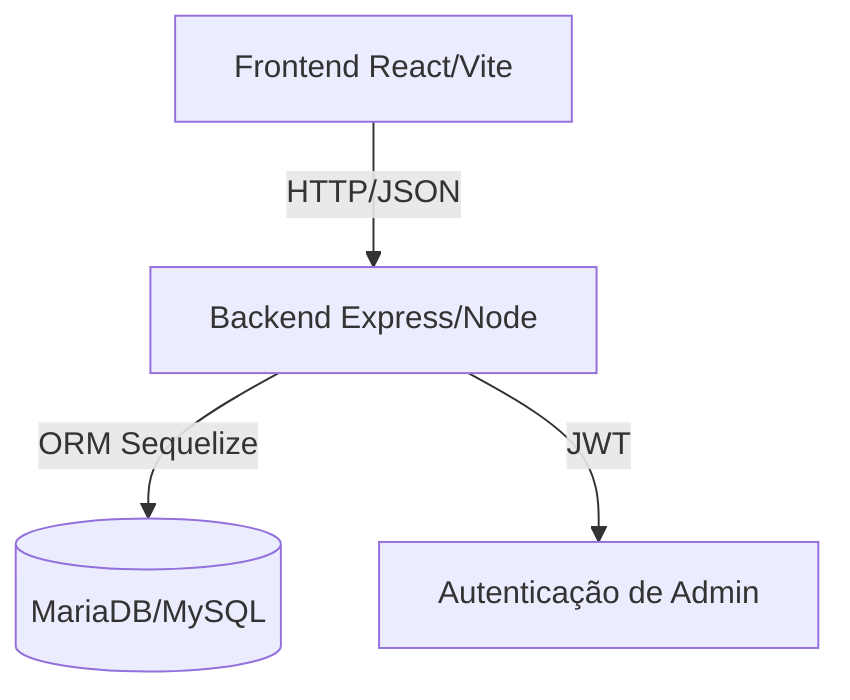

# Arquitetura do Sistema

## Visão Geral
O CARB utiliza uma arquitetura **Full-Stack Monorepo**, dividida em duas camadas principais que se comunicam via API REST.

## 🏗️ Camadas

### 1. Frontend (Client-side)
- **Framework:** React 19+.
- **Build Tool:** Vite (com SWC para alta performance).
- **Estado:** React Hooks (useState/useEffect).
- **Consumo de API:** Axios com instâncias configuradas para baseURL.

### 2. Backend (Server-side)
- **Runtime:** Node.js (ESM Mode).
- **Web Framework:** Express.js.
- **Segurança:** Helmet.js, Express Rate Limit e JWT.
- **ORM:** Sequelize para abstração do banco de dados.

### 3. Banco de Dados
- **Motor:** MariaDB/MySQL.
- **Gestão:** Sincronização automática via Sequelize (Dev) e Migrations (Planejado para Prod).

## 🧪 Qualidade
- **Testes Unitários/Integração:** Vitest.
- **Testes E2E:** Playwright.
- **Type Checking:** TypeScript.
